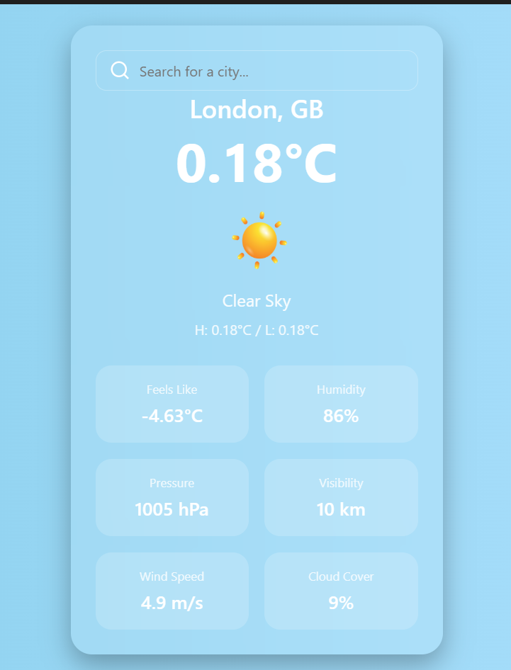

## Weather App

A simple weather app built with Electron, React, and OpenWeatherMap API.

## How to Run

1. Clone the repository
2. Install dependencies
3. Run the app
```bash
  npm install
  npm start
```

## Screen Capture



> Note: The screenshot shows the weather app UI. You can customize the styling and data according to your needs. You can search for any city and get the weather details.

## How to make distribution app
```bash
  npm run package
```
```bash
  npm run make
```
> Note: The distribution app will be available in the `out` directory.
